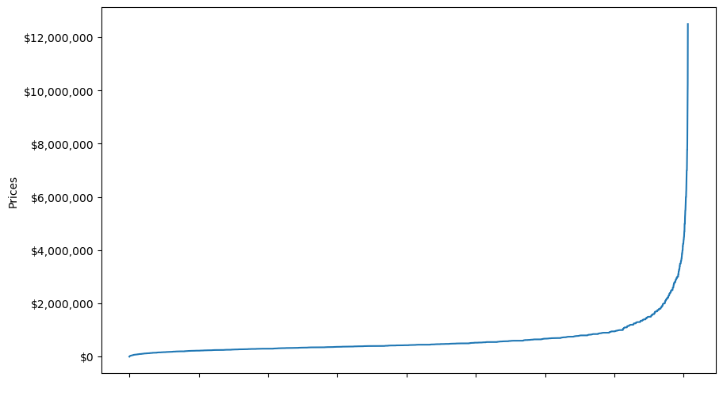
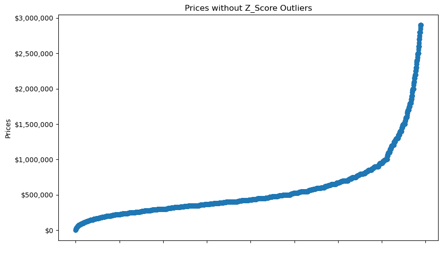

# Capstone_1

## House Prices - Basic Regression Techniques

## Context
### Dataset source : https://www.kaggle.com/datasets/ahmedshahriarsakib/usa-real-estate-dataset
### According to the source of the dataset provided:
#### This dataset contains Real Estate listings in the US broken by State and zip code.

## Business Understanding
### Objective
#### The objective is to find a model that will predict house prices.  This goal will change as the characteristics of the data provided are explored.

#### Many of the features in the dataset provided for this project are described in the "Data Understanding".  We can leverage and tweak them to find the best model.  The initial focus will be to build a codebase that can be leveraged with modifications afterwards.

## Data Understanding

### Data Descriptions
#### Here is the preliminary info about our dataset.
    RangeIndex: 1401066 entries, 0 to 1401065
    Data columns (total 10 columns):
    #   Column          Non-Null Count    Dtype  
    ---  ------          --------------    -----  
    0   status          1401066 non-null  object 
    1   bed             1184538 non-null  float64
    2   bath            1206853 non-null  float64
    3   acre_lot        1043599 non-null  float64
    4   city            1400875 non-null  object 
    5   state           1401066 non-null  object 
    6   zip_code        1400587 non-null  float64
    7   house_size      950954 non-null   float64
    8   prev_sold_date  714773 non-null   object 
    9   price           1400958 non-null  float64
    dtypes: float64(6), object(4)
    memory usage: 106.9+ MB

#### Here is the a list of descriptions for the features in the dataset.
    status (Housing status - a. ready for sale or b. ready to build)
    bed (# of beds)
    bath (# of bathrooms)
    acre_lot (Property / Land size in acres)
    city (city name)
    state (state name)
    zip_code (postal code of the area)
    house_size (house area/size/living space in square feet)
    prev_sold_date (Previously sold date)
    price (Housing price, it is either the current listing price or recently sold price if the house is sold recently)

#### For the purpose of this project a macro level analysis will be conducted at the state level for Connecticut, Massachusetts, NJ, NY, and Pennsylvania.
#### The initial count of houses in each state indicate a sufficient number to provide an adequate range.
#### However after removing duplicate entries this may prove to be a bigger challenge when we try micro level analysis.  But we will continue with this approach for Capstone 1.
<table>
<tr>
<th>Before removing duplicates</th>
<th>After removing duplicates</th>
</tr>
<tr>
<td>
state              Count 
<b>Connecticut        98816</b> 
Delaware            2135 
Georgia               50 
Louisiana              3 
Maine              36650 
<b>Massachusetts     177170</b> 
New Hampshire      51394 
<b>New Jersey        256551</b> 
<b>New York          653061</b> 
<b>Pennsylvania       20060</b> 
Puerto Rico        24679 
Rhode Island       29610 
South Carolina        25 
Tennessee             20 
Vermont            48230 
Virgin Islands      2573 
Virginia              31 
West Virginia          5 
Wyoming                3 
</td>
<td>
state             Count 
<b>Connecticut       13753</b> 
Delaware           1290 
Georgia               5 
Louisiana             1 
Maine              4938 
<b>Massachusetts     10051</b> 
New Hampshire      3431 
<b>New Jersey        32601</b> 
<b>New York          67159</b> 
<b>Pennsylvania       9549</b> 
Puerto Rico        2645 
Rhode Island       3332 
South Carolina        1 
Tennessee             1 
Vermont            2544 
Virgin Islands      730 
Virginia              7 
West Virginia         1 
Wyoming               1 
</td>
</tr>
</table>

#### Improving the Model
##### The price feature appears to be skewed to the right and could use some attention.
##### Whiskers and Zscore can help identify outliers.  After reviewing the results, Zscore appears to be the beter option.
##### Missing values for the bed, bath, acre_lot, and house_size have been replaced with mode().
##### Rows with other missing values will removed.
##### Normalizing the data values will be explored for Capstone 2.
##### Here are samples of graphs for NJ
##### Before ZScore

##### After ZScore

#### State level analysis is provided in Notebooks that contain "LatLong" in the file name.
##### The five states selected worked well with the macro level analysis.
##### There was sufficient data to generate acceptable predictions and results.
##### Here is a sample of macro level analysis from NJ.

<table>
<tr><th>model</th><th>explained variance score</th><th>mae score</th><th>mse score</th><th>r2 score</th><th>mean fit time</th></tr>
<tr><td>Decision Tree Best Params</td><td>0.525465856</td><td>161,667.633996</td><td>76,497,959,521.268478</td><td>0.524659</td><td>0.009398</td></tr>
<tr><td>Recursive Feature Elimination</td><td>0.437692147</td><td>168,477.035464</td><td>90,588,408,113.372543</td><td>0.437104</td><td>0.033879</td></tr>
<tr><td>Sequential Feature Selector</td><td>0.300629820</td><td>197,605.994537</td><td>112,633,815,122.929260</td><td>0.300119</td><td>0.028026</td></tr>
</table>

#### File names with out "LatLong" provide micro level analysis for the location with the most houses.
##### This approach worked well for NJ and NY, but not Connecticut, Massachusetts, and Pennsylvania.
##### There weren't sufficient number of houses in the latter 3 states to generate acceptable predictions and results.
##### Here is a sample of micro level analysis from NY.
<table>
<tr><th>model</th><th>explained variance score</th><th>mae score</th><th>mse score</th><th>r2 score</th><th>mean fit time</th></tr>
<tr><td>Decision Tree Best Params</td><td>0.661461418</td><td>530,364.125397</td><td>747,909,920,375.919312</td><td>0.645625</td><td>0.001765</td></tr>
<tr><td>Recursive Feature Elimination</td><td>0.832403592</td><td>423,355.577778</td><td>370,211,522,923.479004</td><td>0.824586</td><td>0.002797</td></tr>
<tr><td>Sequential Feature Selector</td><td>0.782233403</td><td>471,527.001058</td><td>475,785,667,513.888428</td><td>0.774563</td><td>0.000211</td></tr>
</table>

## Model Comparisons
#### Various feature selectors were used with different models.
<table>
<tr><th>Models</th><th>Feature Selectors</th></tr>
<tr><td>Decision Tree</td><td></td></tr>
<tr><td></td><td>Best Parameters</td></tr>
<tr><td></td><td>Recursive Feature Elimination</td></tr>
<tr><td></td><td>Sequential Feature Selector</td></tr>
<tr><td>K-Nearest Neighbors</td><td></td></tr>
<tr><td></td><td>Best Parameters</td></tr>
<tr><td></td><td>Sequential Feature Selector</td></tr>
<tr><td>Lasso</td><td></td></tr>
<tr><td></td><td>Best Parameters</td></tr>
<tr><td></td><td>Select From Model</td></tr>
<tr><td></td><td>Recursive Feature Elimination</td></tr>
<tr><td></td><td>Sequential Feature Selector</td></tr>
<tr><td>Linear and Polynomial</td><td></td></tr>
<tr><td></td><td>Best Parameters</td></tr>
<tr><td></td><td>Select From Model</td></tr>
<tr><td></td><td>Recursive Feature Elimination</td></tr>
<tr><td></td><td>Sequential Feature Selector</td></tr>
<tr><td>Ridge</td><td></td></tr>
<tr><td></td><td>Best Parameters</td></tr>
<tr><td></td><td>Select From Model</td></tr>
<tr><td></td><td>Recursive Feature Elimination</td></tr>
<tr><td></td><td>Sequential Feature Selector</td></tr>
</table>

## Insights
#### As initially described, working with this dataset is challenging.
#### The provider appears to be appending the updates to the existing file instead of incremental updates.
#### The data for some states works well at a macro level, but insufficient for micro level analysis.
#### The latitude and longitude values that were added gave better results than using zip code.
#### A data source that provides the Latitude and Longitude for zip codes in the US was used for this purpose.
#### KMeans helped to cluster the houses and put them in the correct geographic locations.

## Next steps and recommendations
#### Pricing houses is very location specific.  Geocoding the data was helpful, but the coordinates were almost equivalent to zip code.
#### The surrounding areas around each cluster can vary in the degree of desirability for home buyers.
#### The dataset used here does not provide specific addresses which would be needed for optimal micro level analysis.
#### Also, the other features bed, bath, acre lot, and house size can significantly impact the price.
#### Age of the house is missing from the data.  That is also very important.

## Link to notebook
### https://github.com/jiml-mlai-bootcamp-ucberkeley/Capstone_1